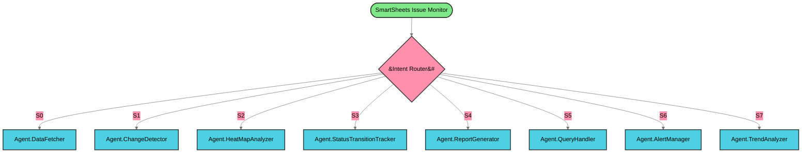

<b>🔍 View Agent Details (Click to Expand)</b>

| Agent | Type | Description |
|-------|------|-------------|
| SmartSheets Issue Monitor | StartAgent | Start agent for workflow with form inputs |
| Intent Router | ConditionAgent | Route user to appropriate agent based on detect... |
| Agent.DataFetcher | Agent | Dynamically choose and utilize tools during run... |
| Agent.ChangeDetector | Agent | Dynamically choose and utilize tools during run... |
| Agent.HeatMapAnalyzer | Agent | Dynamically choose and utilize tools during run... |
| Agent.StatusTransitionTracker | Agent | Dynamically choose and utilize tools during run... |
| Agent.ReportGenerator | Agent | Dynamically choose and utilize tools during run... |
| Agent.QueryHandler | Agent | Dynamically choose and utilize tools during run... |
| Agent.AlertManager | Agent | Dynamically choose and utilize tools during run... |
| Agent.TrendAnalyzer | Agent | Dynamically choose and utilize tools during run... |

